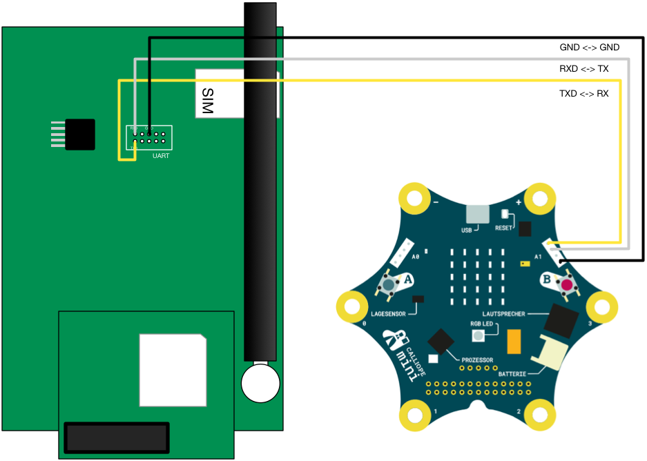
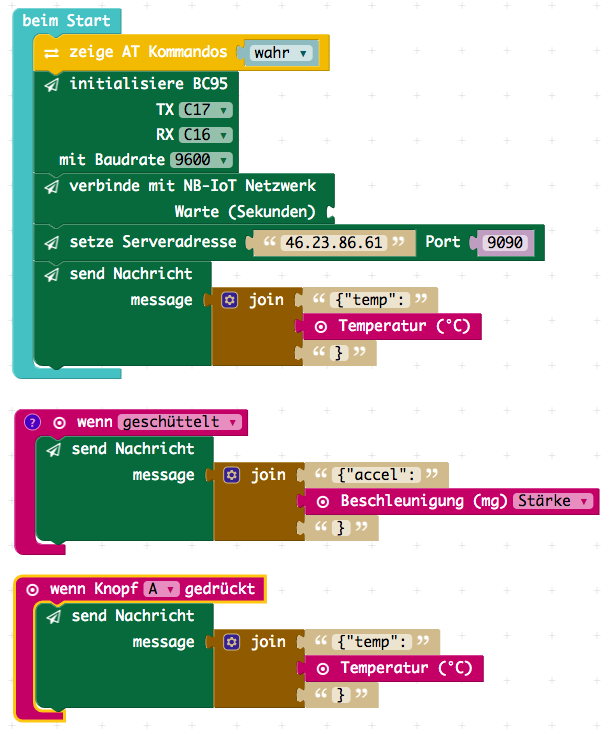

# Calliope mini BC95 NB-IoT module

This is a package for controlling an NB-IoT module to send messages from the Calliope mini.
It can be used by the [PXT Calliope mini editor](https://pxt.calliope.cc/). Should also work
with PXT for Micro:bit.

More information on the module can be found on the [Quectel website](http://www.quectel.com/product/bc95.htm).
It is used in conjunction with an [evaluation kit](http://www.quectel.com/product/gsmevb.htm).

## Wiring the module

- Power the BC95 EVB using the power supply or a battery connector
- Power the Calliope mini using USB or battery
- Connect EVB BC95 and Calliope mini as indicated in the image below:



## Testing

- Modify `tests.ts` to send packages to your own server.
- Execute a little server: `nc -vv -ul -p 9090` (Linux, also echos the messages) 
- Compile the test `pxt test` and copy `built/binary.hex` to the Calliope mini.

On the USB console window you will see this:

```
TEST START
!!!!  BC95/AT TEST
TEST: modem working: OK
TEST: enable all functionality: OK
TEST: check IMSI: OK
TEST: connect to network: OK
TEST: check signal quality: OK
TEST: check network stats: OK
TEST: check PDP context: OK
TEST: check address: OK
TEST: check band: OK
TEST: ping external server: OK
TEST: expect ping reply: OK
!!!!  BC95 TEST
TEST: sending number (temp): OK
TEST: sending number (light): OK
TEST: sending string: OK
TEST FINISHED OK
``` 

> You can follow the AT flow on the USB serial console by enabling debug in `tests.ts`

The server should show something like this:

```
connect to [46.23.86.61] from tmo-121-137.customers.d1-online.com [80.187.121.137] 25519
{"temp":30}{"light":255}{"test":"value 30"}
```

## Example

### Blocks


### Javascript

```typescript
// run on your server server: nc -vv -ul -p 9090
input.onGesture(Gesture.Shake, () => {
    bc95.send(
        "{\"accel\":" + input.acceleration(Dimension.Strength) + "}"
    )
})
input.onButtonPressed(Button.A, () => {
    bc95.send(
        "{\"temp\":" + input.temperature() + "}"
    )
})
modem.enableDebug(true)
bc95.init(
    SerialPin.C17,
    SerialPin.C16,
    BaudRate.BaudRate9600
)
bc95.attach(
    0
)
bc95.setServer("46.23.86.61", 9090)
bc95.send(
    "{\"temp\":" + input.temperature() + "}"
)
```

The first temp is right from the START, the second, pressing Button A and the accel is when shaked.
```
$ listening on [any] 5883 ...
connect to [46.23.86.61] from tmo-121-137.customers.d1-online.com [80.187.121.137] 24189
{"temp":30}{"temp":30}{"accel":2057}
```

## TODO

- handle incoming messages

## Meta

- PXT/calliope
- PXT/microbit

Depends on [pxt-calliope-modem](https://github.com/calliope-mini/pxt-calliope-modem).

Author: Matthias L. Jugel ([@thinkberg](https://twitter.com/thinkberg))

## License

MIT